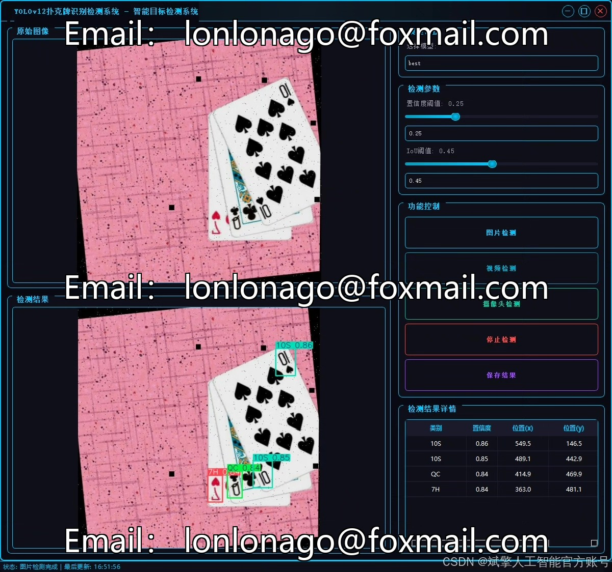
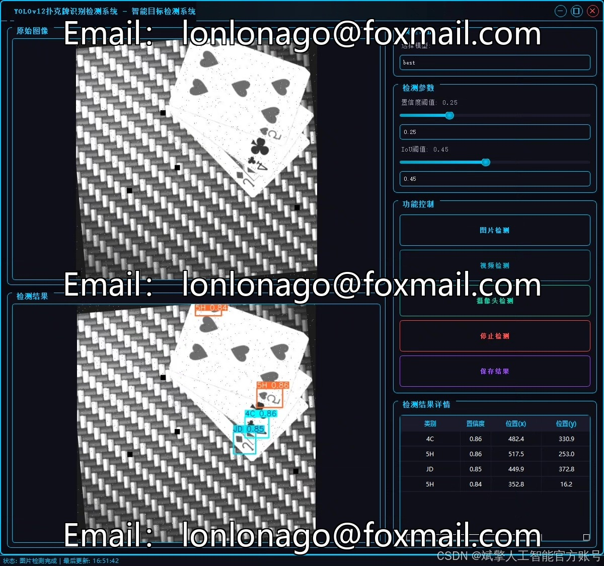
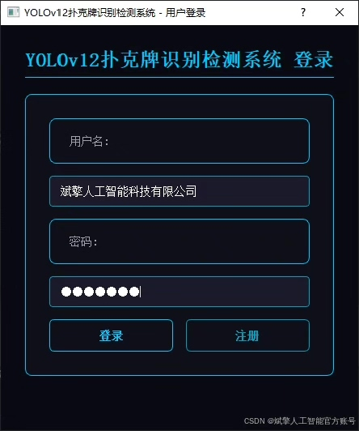
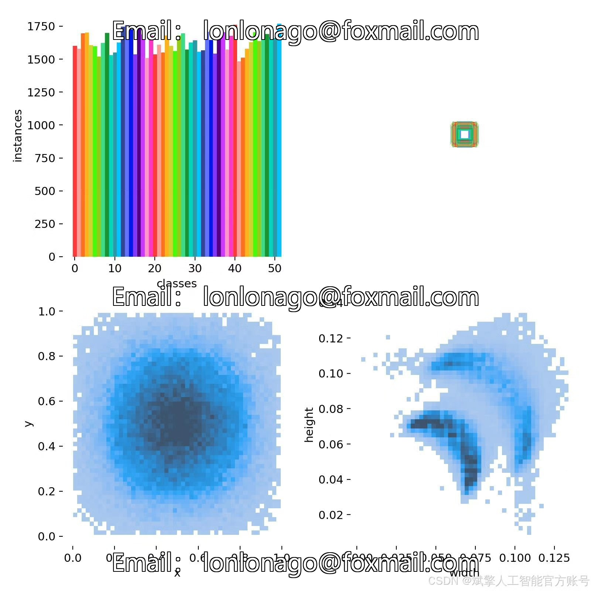
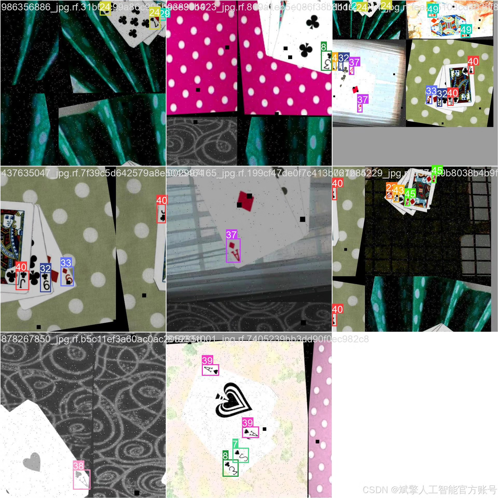
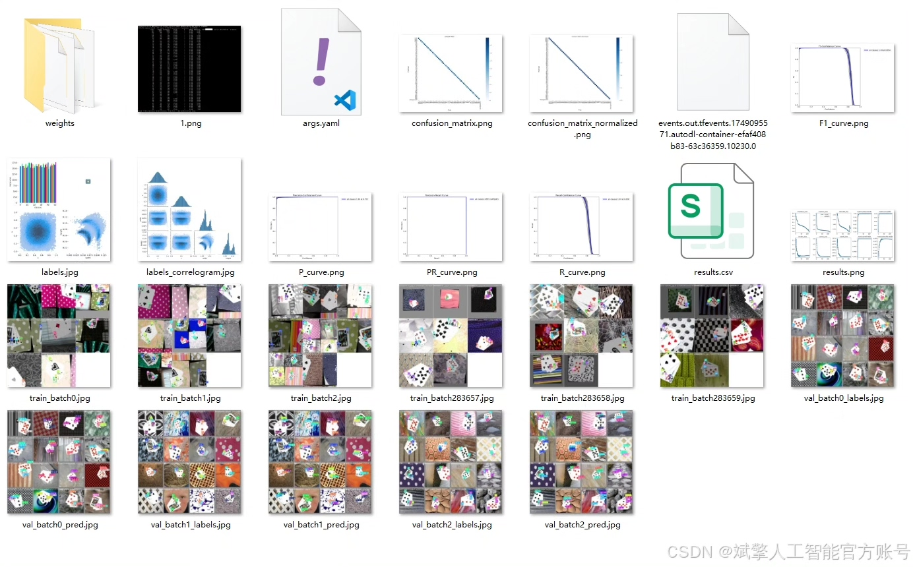
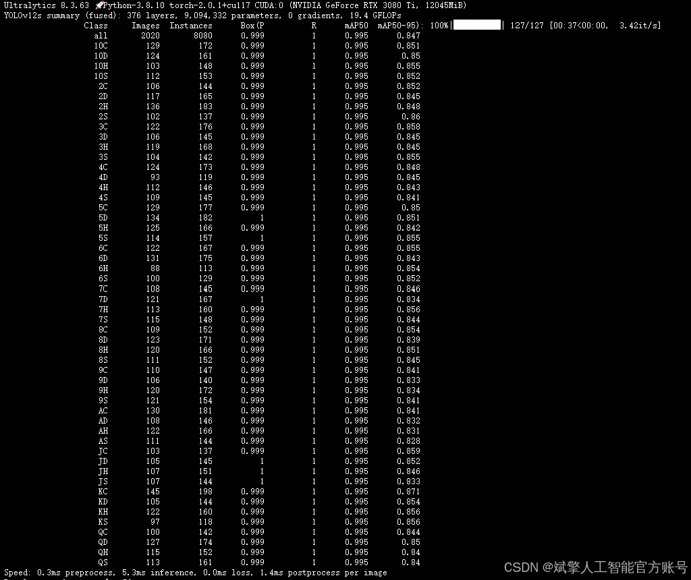
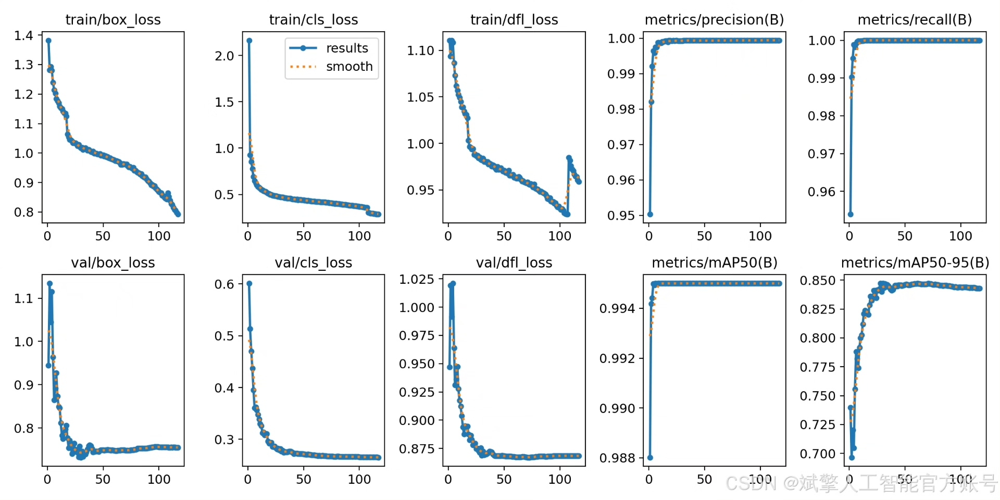
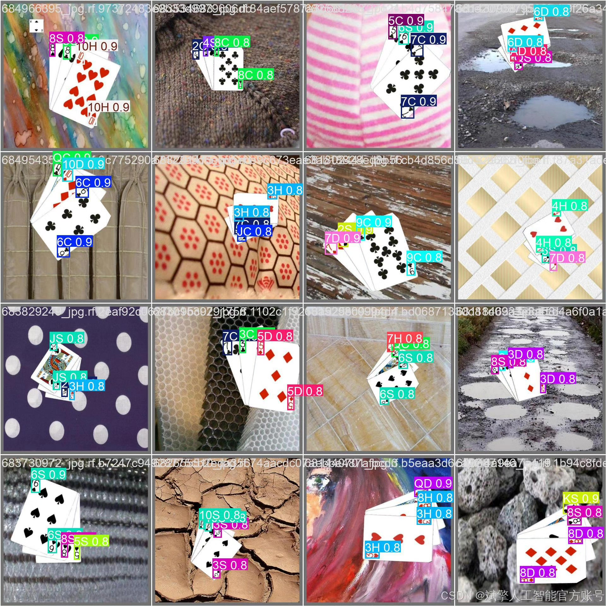

# YOLOv12 Poker Chip Recognition System

## Body

This paper proposes a poker card recognition detection system based on the YOLOv12 deep learning model, which can efficiently and accurately recognize 52 common poker cards (including number cards and flower cards). The system adopts the YOLOv12 object detection algorithm, combined with a custom labeled YOLO format dataset (containing 21,203 training sets, 2,020 validation sets, and 1,010 test sets), to achieve real-time detection of poker card categories (such as 10C, AD, QH, etc.). In addition, the system integrates a user-friendly UI interface, supporting login and registration functions. Experiments show that the system maintains high detection accuracy and robustness in complex backgrounds, and can be applied to game development, intelligent monitoring, and automated sorting scenarios. This paper details the construction of the dataset, optimization methods for the model, and the implementation process of the system, providing complete Python project source code and pre-trained models.
✅ User login and registration: Supports password verification and security validation.
✅ Three detection modes: Based on the YOLOv12 model, supports image, video, and real-time camera detection, accurately recognizing targets.
✅ Dual-screen comparison: Displays the original scene and detection results simultaneously on the screen.
✅ Data visualization: Real-time table displaying the category, confidence, and coordinates of detected targets.
✅ Intelligent parameter adjustment: Provides a confidence slide bar to dynamically optimize detection accuracy, adapting to different scene requirements.
✅ Sci-fi style interactive interface: Dark theme paired with dynamic light effects, reducing visual fatigue and improving operational experience.

## Images

## Payment

Here is a pay link on Stripe ( https://buy.stripe.com/3cs8yP7sY87d0vu9AB ). Please contact me lonlonago@foxmail.com after funding $89, and I will send you a complete data files , thank you!

